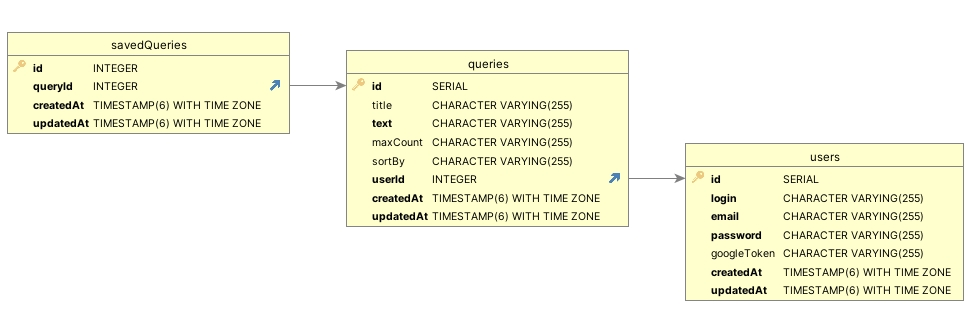

**YoutubeSPA**

**Описание**: 

Авторизованные пользователи могут запрашивать видео с youtube. Запросы хранятся в базе данных. Запрос можно добавить в избранное, удалить и отредактировать

"YoutubeSPA" - это одностраничное веб-приложение (SPA), разработанное для работы с видео-контентом с платформы YouTube. Это приложение позволяет пользователям просматривать, искать и воспроизводить видео с YouTube.

**Основные возможности и функциональность** проекта включают в себя:
Поиск видео: Пользователи могут использовать поисковую строку  для поиска видео на YouTube по ключевым словам или фразам. 
Просмотр видео: После выполнения поиска или просмотра популярных видео, пользователи  
    могут просматривать выбранные видео во встроенном видеоплеере.

    Пагинация результатов поиска: При наличии большого количества результатов поиска  
    или видео, проект обеспечивает пагинацию для удобного навигации по результатам.

    Отображение информации о видео: Каждое видео снабжено краткой информацией, такой как 
     название, описание, дата загрузки и количество просмотров.

    Рекомендации и похожие видео: Проект может отображать рекомендации или похожие видео,  
    основанные на текущем видео, которое просматривает пользователь.

    Интеграция с API YouTube: Для доступа к данным и функциональности YouTube используется  
    YouTube API, который обеспечивает доступ к видео, каналам, плейлистам и другим данным.

**Использованые технологии:** 

    Фреймворк: express
    Работа с базами данных: postgreeSQL, sequelize
    Шифрование и авторизация: bcrypt, jwt
    Документация: swagger 
    Другие: axios, cache-manager, lodash, cors

Схема базы данных состоит из 3-х таблиц: User, Query (со всеми запросами пользователя), SavedQuery (с сохраненными запросами)

